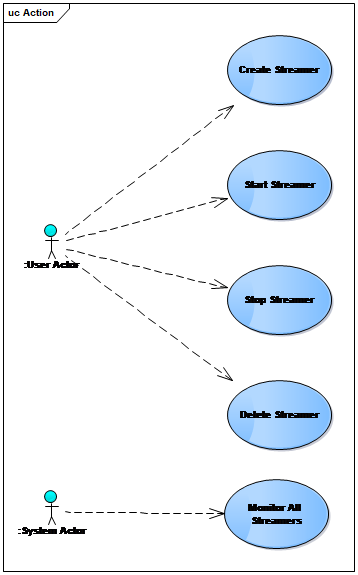

# Background
This application is the data collection layer of project [Big Data Analysis and Artificial Intelligence Integrated Platform](./docs/Big%20Data%20Analysis%20and%20Artificial%20Intelligence%20Integrated%20Platform.md)

This software development adopts iterative development. The entire development work is organized into a series of short, fixed-length (such as 2 weeks) small projects, called a series of iterations. Each iteration includes requirements analysis, design, implementation and testing. Using this method, development work can be started before the requirements are completely determined, and part of the system functions or business logic development work can be completed in one iteration. Then use customer feedback to refine requirements and start a new round of iteration

# Requirement
## General Requirement
Massive industrial time series data can be sent continuously for 7*24 hours. Data collection for structured, semi-structured and unstructured data, while taking into account scalability and processing performance.
## Function Requirement
Create a Data Stream and write the data of the Data Source into ELK.
Source may be a variety of data sets. At present, Kafka or CSV files are first implemented as data sources. However, the design needs to consider the possibility of adding other data sources, such as databases and other message queues in the future.  
The connection configuration of the Data Source comes from the REST API (all the content of the REST API is described in detail later), which is provided by the user. The system will provide an interface similar to the following for users to fill in data source information:

The target of the data stream is Elasticsearch, and the index required by Elasticsearch is provided by the user through the REST API. API can create, list, start, stop, delete index

## Persistence Requirement
All streamers can resume working after restart, so there are persistence requirement:
+ Simplified Performance Scaling
+ Strong Data Consistency
+ Fault Tolerance
+ Lower Total Cost of Ownership
## Telemetry Requirement
FrontEnd need view all streamer performance index, so backend need provide api to get these information.
## Test Requirement
+ Unit framework uses TestNG
+ Unit test coverage >= 40%
+ The csv test data uses New York taxi data 2017 (around 10G), January data
The link is as follows:  
https://data.cityofnewyork.us/Transportation/2017-Yellow-Taxi-Trip-Data/biws-g3hs

# General Design
## Analysis
1. Project scenario is high concurrency for big data streaming. So we simulate 1000 thread to streaming data together in previous research. Fist we use kafka, but we found when thread>100, Kafka performance reduce very quickly. So we change to **Akka**, and we found when thread > 100, Akka erformance is much better than Kafka. So finally we decide to use Akka technology.  
2. If datasource is DB, we use Prestro, it can query different data sources, so if the data source is DB, Pestro's ANSI SQL is used as the SQL statement.  
3. ElasticSearch provide new Rest Client now, so no use Transport Client anymore.
4. For streamer persistence, we choose ArangoDB to save streamer: 
    + It is an open source distributed multi-model NoSQL database that supports Key-Value, Document, and Graph storage. ArangoDB uses SQL-like AQL language for query, AQL query, ArangoDbAdapterTest contains a lot of AOL. Open source and free
    + The data model of ArangoDB is divided into database (databse), collection (collection), document (document), respectively corresponding to the database, table, and row in the RDBMS.
    + Data types include: string, boolean, number, array, document/object
    + Collection: Divided into two types: document collection and edge collection. Among them, document collection is also called vertex collection in Graph, and edge collection is only used in Graph.
    + Document: ArangoDB's document data uses the JSON format in the presentation layer, but the physical storage uses the binary VelocyPack (an efficient and compact binary serialization and storage format). Document consists of a primary key (_key), _id, _rev, 0 or more attributes, and _key is used as the basis for sharding. Documents in Edgecollection have two more special attributes (_from, _to) than documents in documentcollection.
## COTS Used in Backend Development
Name | Version
---- | ----
Springboot | 2.2.4
ElasticSearch | 6.8.6
Kafka | 2.3.1
Akka | 2.6.3
Logback | 1.2.3
ArangoDB | 6.6.1
TestNg | 7.1.0
## Akka Framework
Because of the use of Akka, the Actor model is adopted. The Actor model was proposed by Carl Hewitt in 1973, and Gul Agha published a technical report "Actors: A Model of Concurrent Computation in Distributed Systems" in 1986. The Actor model is a relatively common model in concurrent programming. Many development languages provide native Support, such as erlang, scala, etc.  
I think most people are not familary with Akka, so I explain it in detail, if you already know this, can skip this chapter  
Akka is an actor Syystem    
  

The features of the Actor model are as follows:
+ Actor refers to a basic computing unit, everything is Actor. Actor and Actor do not share memory, there is no mutual call, only message notification, the data state of Actor is completely maintained by itself;
+ Actor can be simply understood as the whole of data, behavior and message. Data refers to internal state and context, behavior refers to the logical processing method, and message refers to the type of message that can be processed;
+ It is fault-tolerant. Erlang introduces the philosophical concept of "crash with it". This part of the key code is monitored. The only responsibility of the monitor is to know what to do after the code crashes (such as resetting the unit code to a normal state), Actor You can also develop supervision strategies for yourself, such as restarting the Actor after an exception occurs to make it self-healing;
+ With distributed characteristics, one actor sends a message to another actor, it does not care whether it is local or remote, as long as the message can arrive, which allows us to build a cluster system on multiple machines;
+ The relationship between the thread and the Actor model is more abstract than the thread update, and the underlying implementation is implemented by the thread pool, but the shadow of Thread cannot be seen in the programming process  

The task scheduling method of the Actor model is divided into thread-based scheduling and event-based scheduling, and the general implementation will be based on event scheduling.

### Actor Model
An actor system must start at least three actors during its creation, as shown in the following figure:

1. /: Root supervisor  
As the name suggests, it is a boss, it supervises all the top Actors in the ActorSystem, the top Actors have the following types:  
/user: is the supervisor of all top-level actors created by users; actors created with ActorSystem.actorOf are under it.  
/system: It is the supervisor of all top-level actors created by the system, such as log listeners, or actors that are automatically deployed when the actor system is started by configuration.  
/deadLetters: is a dead letter actor, all messages sent to terminated or non-existent actors will be redirected here.  
/temp: It is the supervisor of all short-term actors created by the system, such as those used in the implementation of ActorRef.ask.  
/remote: is an artificial virtual path used to store all actors whose supervisor is a remote actor reference.  
The one that we usually deal with most often is /user, which is the supervisor of the actor created by ActorSystem.actorOf in the program. The following fault tolerance is our focus on the failure handling below it. The specific function definitions of several other top Actors have been Given, those who are interested can also find out.  
The root supervisor supervises all top actors and handles their various failures. Generally speaking, if the error rises to the root supervisor, the entire system will stop.  
2. /user: Top actor supervisor  
As mentioned above, /user is the supervisor of all top-level actors created by users, that is, actors created with ActorSystem.actorOf. We can formulate corresponding supervision strategies by ourselves, but since it is generated when the actor system is started, we Need to be configured in the corresponding configuration file, the specific configuration can refer to the official Akka documentation
3. /system: system supervisor  
/system Supervisors of all top actors created by the system, such as the log listener in Akka, because the log itself is also implemented by Actors in Akka. The supervision strategy of /system is as follows: except for ActorInitializationException and ActorKilledException received All Exceptions of Exception will be restarted indefinitely, and of course this will also terminate all of its child actors. All other Throwables are raised to the root supervisor, and then the entire actor system will be shut down.

# Detail Design
## Class Design
Please see below class diagram to understand the code

## Scenario

1. Startup  
When the program starts, first create Root Actor, and then create User Actor and System Actor from Root Actor. Next, User Actor will create each Stream Actor, which can be extended in the future  

2. Create new streamer to ELK  
According to the index passed from rest api, create a new streamer and generate streamerId. streamerId = hash(indexName, sourceName, connectionString, userId), generated for the hash of the following four items. These 5 fields are basic fields, and they are determined to remain unchanged when they are expanded in the future.  

3. Start Streamer Actor  
All Actors are automatically started when they are created, but for various reasons, if the Stream Actor is manually stopped by the user (via Rest api), the next time it is started, as long as the mailbox is persisted, restarting the Actor can still receive Previous offline messages. But restarting the Actor is equivalent to re-creating the Actor again, but it has no effect on the entire message flow processing.  

4. Stop Streamer Actor  
Stopping the Streamer Actor will stop the process of receiving data from the outside world and storing it in ELK. Generally, when the streamer is not used for a long time, stop the Actor to save resources. Stop the Streamer Actor and keep this Actor mailbox in order to receive offline messages. 

5. Delete Streamer Actor  
Deleting the Streamer Actor will completely delete all the information of this Streamer, the mailbox will no longer be retained, and the StreamerId will be deregistered. Whether to delete the data of this streamer in ELK is open to question.

6. View the current status of all Streamers  
Monitor the status of all Streamer Actors through System Actor, including cpu occupancy, memory occupancy and network throughput:

# Summary
The Actor model chosen this time is mainly due to high concurrency requirements. If you develop multithreading yourself, you have to deal with a series of issues such as concurrency, locks, thread synchronization, etc., using the Akka model, you can no longer consider these underlying layers when implementing multithreaded applications. In fact, each Actor is a thread, and their mailbox is also a thread. In other words, as many actors as you have, there are as many threads as double. The Actor model is event-driven, and Actors perform work in response to messages. The communication between Actors is asynchronous, allowing Actors to send messages and continue their work without blocking waiting for a reply.

## License

KubeEdge Mapper is under the Apache 2.0 license. See the [LICENSE](LICENSE) file for details..